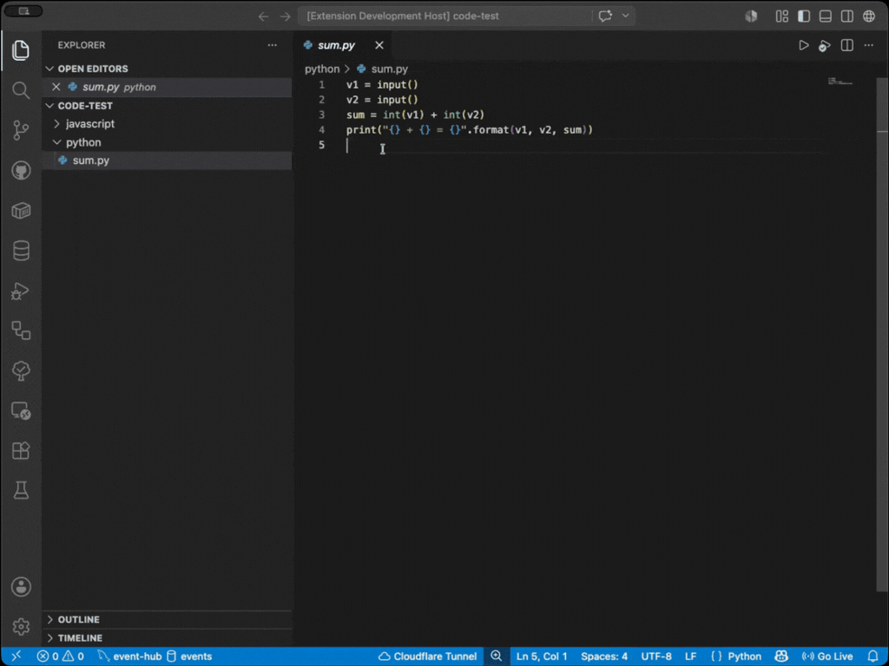
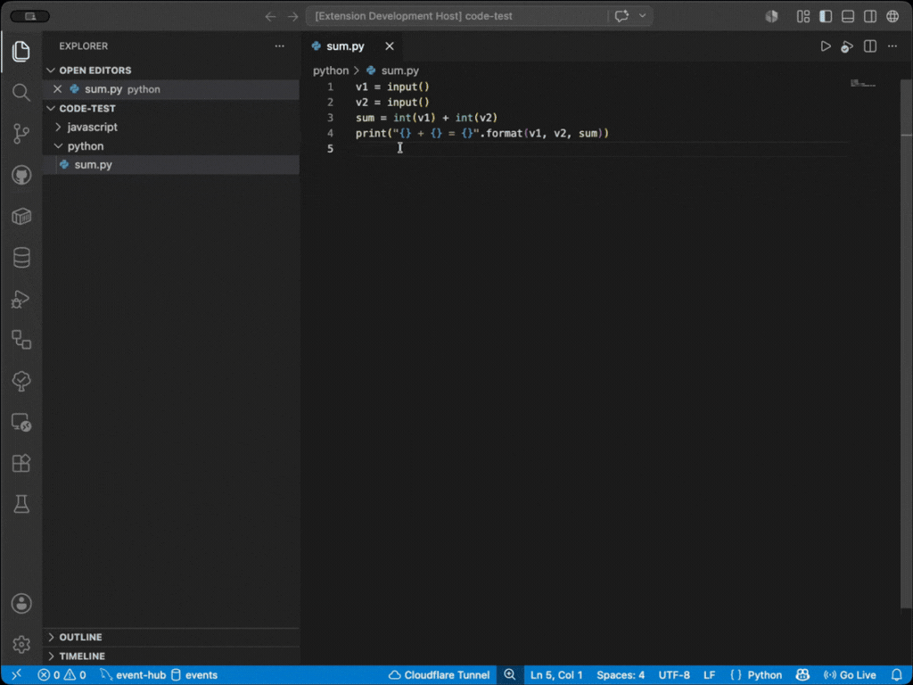
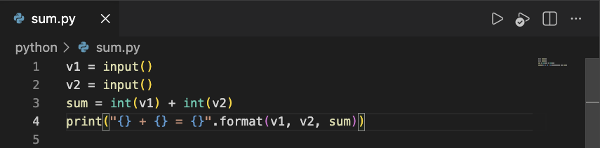
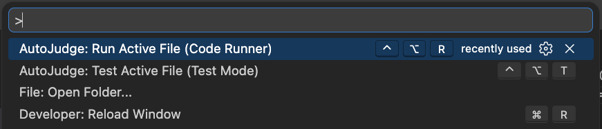

# AutoJudge

Run and test competitive programming files directly from VS Code against the [AutoJudge](https://autojudge.io) API.

Use Code Runner mode for fast output checks, or Test mode for strict `.in`/`.out` validation.



## Features

- Run the active file without leaving the editor.
- Test your code against local testcase pairs from a folder.
- Connect to `https://api.autojudge.io` or your own self-hosted AutoJudge API.

## Install

Install from the VS Code Marketplace, or run:

```bash
ext install autojudge.autojudge-extension
```

## Quick Start

1. Open a saved source file.
   - Supported languages: C, C++, Java, JavaScript, PHP, Python (see Supported Languages below for extensions).
2. Create some `.in` files in the same folder with your test inputs, and optionally matching `.out` files with expected outputs.
3. Run one command:
   - `AutoJudge: Run Active File (Code Runner)`
   - `AutoJudge: Test Active File (Test Mode)`
4. Check the `AutoJudge` output channel for folder resolution, queue id, outputs, and final status.

## Commands

- `AutoJudge: Run Active File (Code Runner)`
  - Command id: `autojudge.runActiveFile`
  - Purpose: Fast run path, ignores `.out` files.


- `AutoJudge: Test Active File (Test Mode)`
  - Command id: `autojudge.testActiveFile`
  - Purpose: Strict run path, requires matching `.out` files for discovered `.in` files.



Both commands are available from the Command Palette and from the editor title icon when a supported saved file is active.





## Keyboard Shortcuts

- `Ctrl+Alt+R`: Run Active File (Code Runner)
- `Ctrl+Alt+T`: Test Active File (Test Mode)

## Configuration

- `autojudge.baseUrl`
  - Full AutoJudge API base URL.
  - Default: `https://api.autojudge.io`
  - You can set this to your own self-hosted AutoJudge API if desired. Check [AutoJudge on GitHub](https://github.com/werlang/autojudge) for server code and deployment instructions.
- `autojudge.testcasePath`
  - Optional testcase folder.
  - Supports VS Code variables such as `${workspaceFolder}` and `${fileDirname}`.
  - Leave blank to use the active source file directory.

Example:

```json
{
  "autojudge.baseUrl": "http://localhost:3000",
  "autojudge.testcasePath": "cases"
}
```

This example points to a local AutoJudge server and configures a `cases` folder inside the active file directory for testcases.

## Mode Behavior

### Code Runner Mode

- Sends discovered inputs only.
- Ignores `.out` files completely.
- Best for quick feedback and debugging.

### Test Mode

- Uses the same input resolution as Code Runner mode.
- Requires a matching `.out` file for each discovered `.in` file.
- Stops before queueing if one or more `.out` files are missing.
- Sends both inputs and expected outputs when all pairs are present.

## Supported Languages

We determine the language from the active file extension. Supported extensions:
- C: `.c`
- C++: `.cpp`
- Java: `.java`
- JavaScript: `.js`
- PHP: `.php`
- Python: `.py`

## Sample Source Files and Testcases

See the `samples` folder for example source files and testcases to try out.

## Troubleshooting

- Ensure `autojudge.baseUrl` points to an AutoJudge API endpoint (live server or self-hosted).
- If Test mode fails immediately, verify every `.in` has a same-name `.out` file.
- If no `.in` files exist, AutoJudge sends one empty input by design.

## Release Notes

See [CHANGELOG.md](CHANGELOG.md) for version history.

## Development

1. Start the container: `docker compose up -d --build`
2. Install dependencies: `docker compose exec extension npm install`
3. Run tests: `docker compose exec extension npm test`

All repository tooling should run through the `extension` service.
